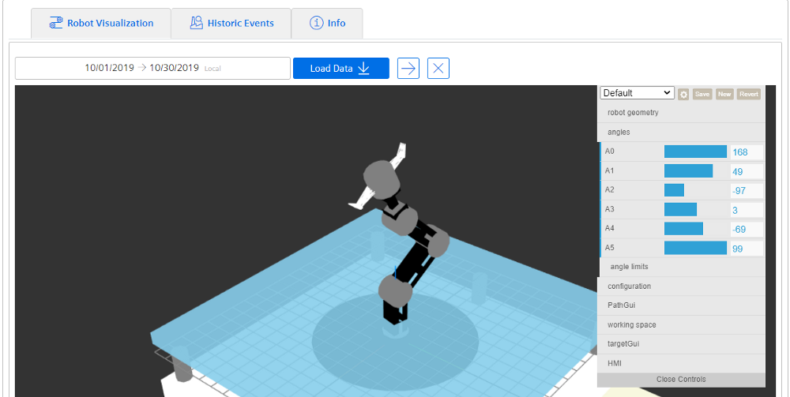
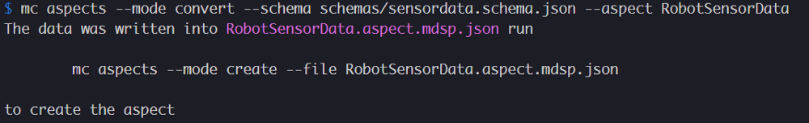
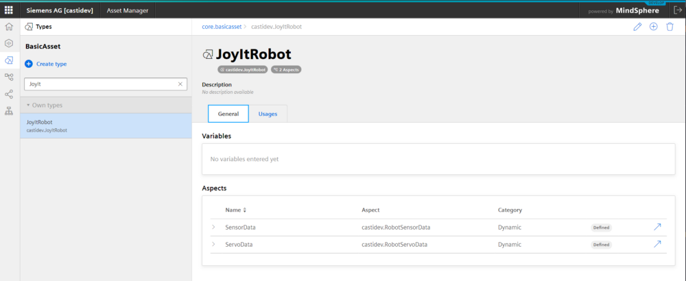
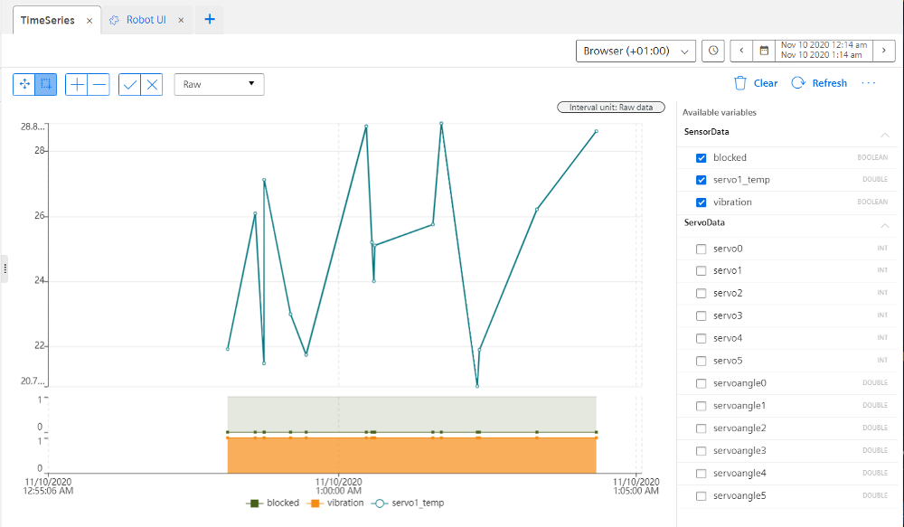

# json-schema-to-mindsphere-demo-app

## How to create MindSphere Artefact from JSON Schema defintions

You can create all MindSphere modelling artefacts ([Variables, Aspect- and Asset Types as well as Assets](https%3A%2F%2Fdeveloper.mindsphere.io%2Fapis%2Fadvanced-assetmanagement%2Fapi-assetmanagement-samples-modelingassets.html)) straight from a JSON Schema. This means that if you already have JSON data gathered from your industrial assets (e.g. because they are already available on your production data bus) you can leverage your existing JSON schemas (or extract them from JSON data) to quickly create all needed MindSphere artefacts.

## Example Data

Let's assume that you are modelling a digital twin of a robot with several servomotors, like this one in the picture (This is a [Joy-IT Robo-Set](https%3A%2F%2Fwww.conrad.de%2Fde%2Fp%2Fjoy-it-robo-set-raspberry-pi-3-b-1-gb-4-x-1-2-ghz-inkl-roboterarm-inkl-controller-inkl-kuehlkoerper-inkl-netzteil-1611553.html) toy robot equipped with Raspberry PI which I am using for this example)



The robot is capable of sending the power applied by each servo-motor (servo0-servo5), the angle data (servoangle0-servoangle5) on the joints and the sensor data with temperature on the motor1 and the indicators if the motor is blocked or vibrating over MQTT:

**Servomotor data for the Robot**:

```javascript
{
    "servos": {
        "servo0": 2366,
        "servo1": 2366,
        "servo2": 2100,
        "servo3": 1672,
        "servo4": 2086,
        "servo5": 1500
    },

    "angles": {
        "servoangle0": 2.9296323044556787,
        "servoangle1": 2.41781015480265,
        "servoangle2": 2.5120105504443115,
        "servoangle3": 1.8400477282004584,
        "servoangle4": 2.490030458127924,
        "servoangle5": 1.5700065940276948
    }
}
```

**Sensor data for the robot:**

```javascript
{
    "blocked": false,
    "vibration": true,
    "servo1_temp": 21.67
}
```

First step is to extract the JSON Schema from the existing data. (In a real manufacturing project, the chances are high that the equipment manufacturer would provide these schemas. We can use e.g. [https://jsonschema.net/](https://jsonschema.net/) to extract the corresponding schemas

The schemas are available in `schemas/` directory.

We can use this information to create all necessary MindSphere Modelling artefacts and start sending data to MindSphere.

## Creating MindSphere Assets from JSON Schema

### Step 0: Setup the MindSphere CLI

```bash
npm install @mindconnect/mindconnect-nodejs -g
```

Install and setup the CLI from npm as specified [here](https%3A%2F%2Fopensource.mindsphere.io%2Fdocs%2Fmindconnect-nodejs%2Fcli%2Fsetting-up-the-cli.html) or [download binaries](https%3A%2F%2Fgithub.com%2Fmindsphere%2Fmindconnect-nodejs%2Freleases) from GitHub and put them in the path.

### Step 1: Convert the JSON Schema to MindSphere Aspect Definition

The conversion can be done using the following CLI commands.

```bash
mc aspects --mode convert --schema schemas/servodata.schema.json --aspect RobotServoData
mc aspects --mode convert --schema schemas/sensordata.schema.json --aspect RobotSensorData
```



The aspect definition is very similar to the original schema but it uses MindSphere data types, adds quality codes etc. It also flattens the schemas as MindSphere allows only one level of depth in the asset definitions.

```javascript
{
  "name": "RobotSensorData",
  "category": "dynamic",
  "scope": "private",
  "description": "The root schema comprises the entire JSON document.",
  "variables": [
    {
      "name": "blocked",
      "dataType": "BOOLEAN",
      "unit": ".",
      "searchable": true,
      "length": null,
      "qualityCode": true
    },
    {
      "name": "vibration",
      "dataType": "BOOLEAN",
      "unit": ".",
      "searchable": true,
      "length": null,
      "qualityCode": true
    },
    {
      "name": "servo1_temp",
      "dataType": "DOUBLE",
      "unit": ".",
      "searchable": true,
      "length": null,
      "qualityCode": true
    }
  ]
}
```

### Step 2 Create Aspects in MindSphere

Now that we have aspect definitions in MindSphere format it is time to create the aspects in MindSphere (note that we ignored the units for the variables, if you want to add them, edit the aspect.mdsp.json file before running the following commands)

```bash
mc aspects --mode create --file RobotSensorData.aspect.mdsp.json
mc aspects --mode create --file RobotServoData.aspect.mdsp.json
```

This will create the corresponding aspects in MindSphere. We can observe them in the Asset Manager.

### Step 3 Create Asset Type in Mindsphere

The next step is to create an asset type for our robot

```bash
mc asset-types --mode template --assettype JoyItRobot
```

This creates a template file JoyItRobot.assettype.mdsp.json which we will modify to use our two aspect definitions. (_note: my tenant is called castidev; modify the definition to use your tenant name_)

```javascript
{
    "name": "JoyItRobot",
    "description": "",
    "parentTypeId": "core.basicasset",
    "instantiable": true,
    "scope": "private",
    "aspects": [
        {
            "name": "SensorData",
            "aspectTypeId": "castidev.RobotSensorData"
        },
        {
            "name": "ServoData",
            "aspectTypeId": "castidev.RobotServoData"
        }
    ],
    "variables": [],
    "fileAssignments": []
}
```

Creating the asset type in MindSphere is only one command away:

```bash
mc asset-types --mode create --file JoyItRobot.assettype.mdsp.json
```



### Step 4: Creating an Asset Instance

We can use the CLI to create an instance of the JoyItRobot type which will represent our demo robot. (All of these tasks can be done in MindSphere-UI, I am just using the CLI for consistency)

```bash
mc assets --mode create --typeid castidev.JoyItRobot --assetname JoyItRobot_1
```

Now that we have our asset we can use e.g. Node-RED or code our own project to send data from our MQTT topics to MindSphere. Take a look at [the live example at playground.mindconnect.rocks](https://playground.mindconnect.rocks/#flow/996ec513.e1f4d8)

## Sending data to MindSphere using starter project

The starter project (which was created using `mc starterts` command is available in the starterts directory)

see [How To Use Starter Projects](https://opensource.mindsphere.io/docs/mindconnect-nodejs/agent-development/starter-projects.html)

You will need agent credentials in the starterts directory and installed nodejs dependencies.

```bash
cd starterts
npm install
mc create-agent --config agentconfig.mdsp.json
```

After that change the line 23 in `index.ts` to use the asset id of your JoyITRobot_1 asset (e.g. run `mc assets --typeid Robot` command in the CLI to see the id.

```javascript
// you can use agent.Sdk().GetAssetManagementClient() to get the asset id and asset type from mindsphere
// or just copy them from Asset Manager
const targetAssetId = "1234567....";
```

Run `npm start` in starterts directory to start sending data to Mindsphere.

This should produce following output

```bash
$ npm start

> mc-agent-ts@1.0.0 start C:\git\robotic\starterts
> tsc && node index.js

[2020-11-10T01:15:42.537Z] Agent onboarded
[2020-11-10T01:15:52.938Z] Iteration : 0
[2020-11-10T01:15:53.150Z] Data posted
[2020-11-10T01:15:54.473Z] event posted
[2020-11-10T01:15:55.810Z] Iteration : 1
[2020-11-10T01:15:56.017Z] Data posted
[2020-11-10T01:15:57.444Z] event posted
[2020-11-10T01:15:58.665Z] Iteration : 2
[2020-11-10T01:15:59.115Z] Data posted
[2020-11-10T01:16:00.421Z] event posted
[2020-11-10T01:16:01.651Z] Iteration : 3
[2020-11-10T01:16:01.824Z] Data posted
[2020-11-10T01:16:03.020Z] event posted
[2020-11-10T01:16:04.315Z] Iteration : 4
[2020-11-10T01:16:04.458Z] Data posted
[2020-11-10T01:16:06.050Z] event posted
```

And if you take a look at Fleet manager you should be able to see the corresponding data



You can use this app as a starting point for your MindSphere integrations.
